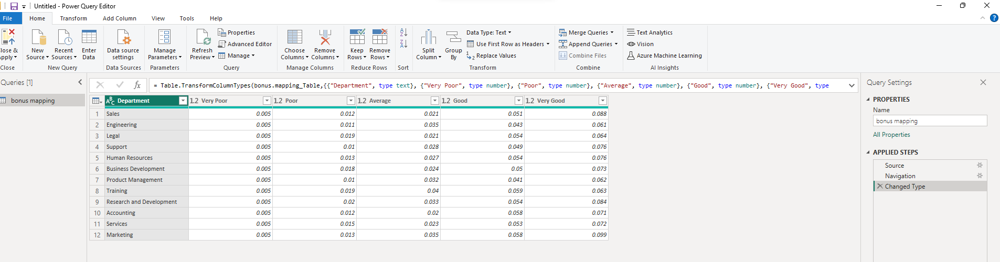
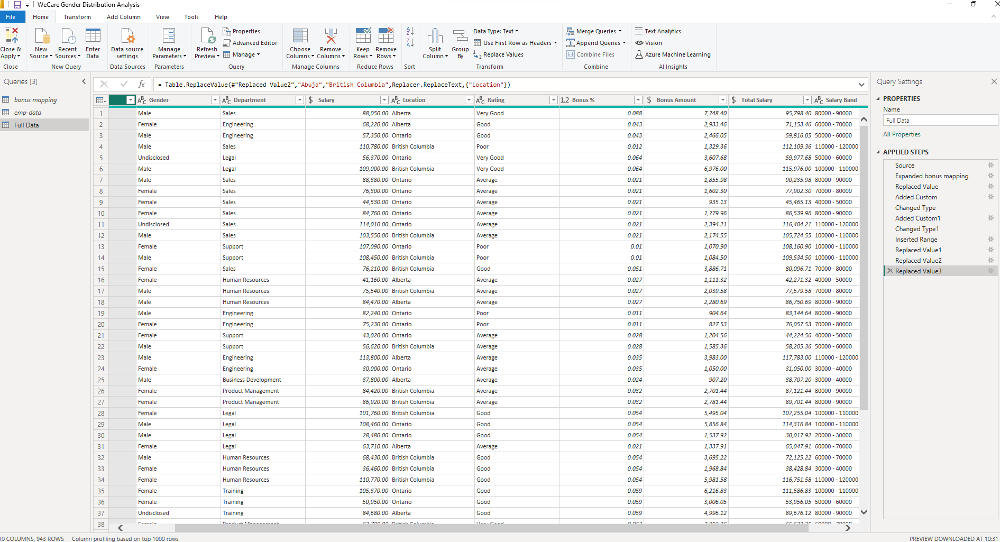
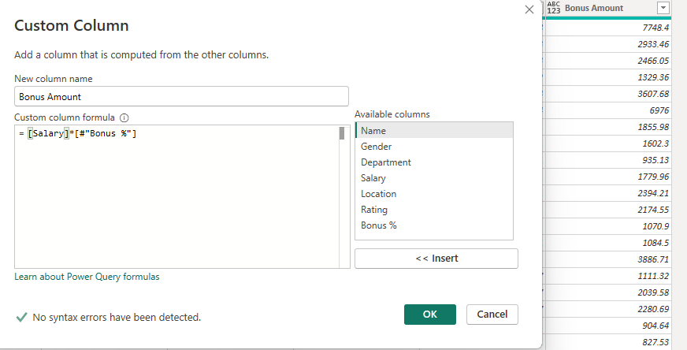
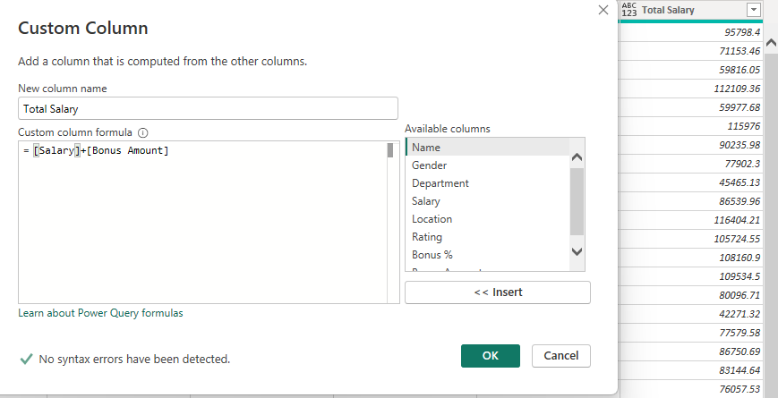
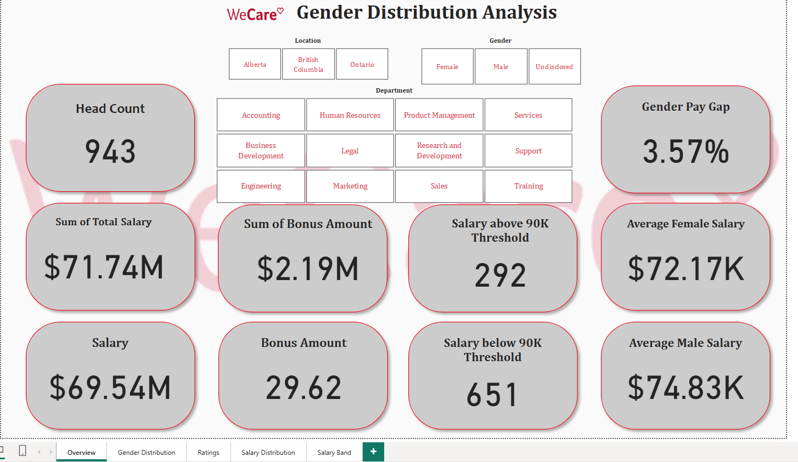
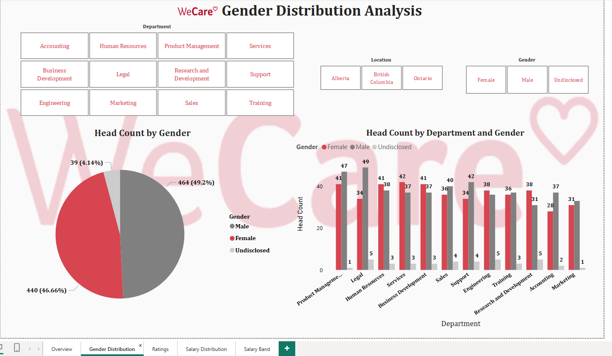
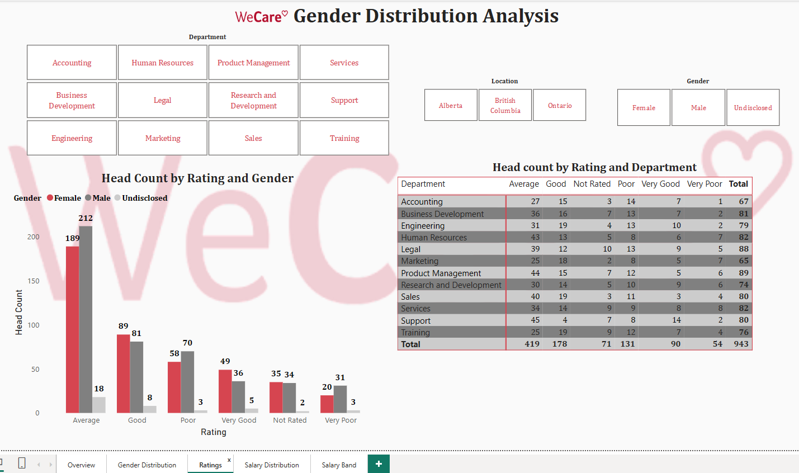
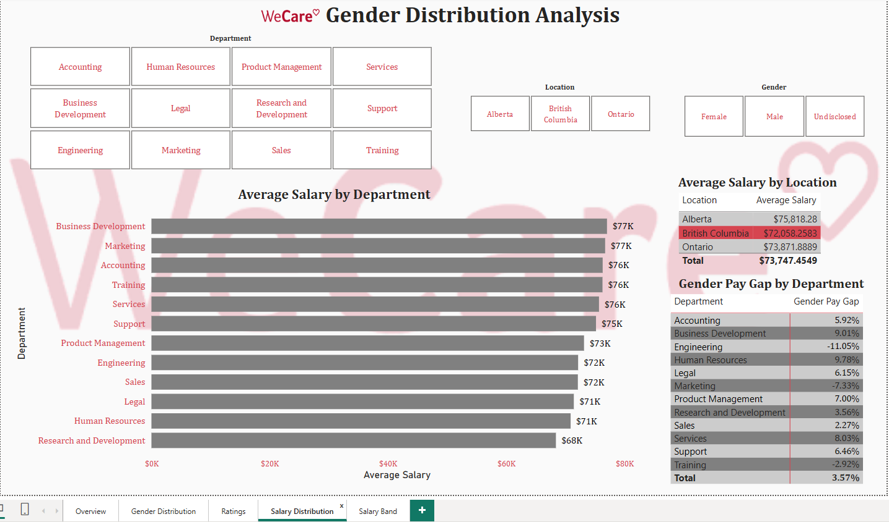
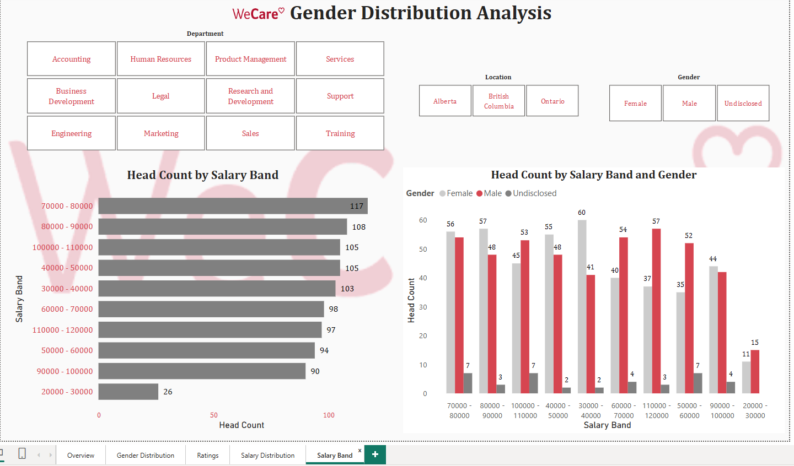

# WeCare Gender Inequality Analysis

## Introduction

**WeCare**, a Canadian hospitality company, is embroiled in issues related to gender inequality in
 its three regions. Unfortunately, the media recently published a news article with the headline
 “WeCare, the Hospitality Patriarchy.” This doesn’t look good for the business owners, given
 their ambition to scale the business to other regions and even overseas. Cases like this can only
spiral downwards, revealing other issues like the gender pay gap, among other possible issues.

**_Disclaimer_**: _All datasets and reports do not represent any company, institution, or country, but
are just dummy datasets to demonstrate the capabilities of Power BI._ 

This documentation outlines the data cleaning process for WeCare. Two sets of data were given to
conduct research and analyze the issues the company is currently facing. The datasets are given below;

•	The bonus mapping: This contains the rules for making payments to the employees in the company and their work ratings.

•	The emp_data: This contains the employee's details.

 I looked into the data set, and the data cleaning process was completed in the Power Query
environment, a powerful data transformation tool, and I analyzed and generated insights that
the management team needs to address.

## Problem Statement
1.	What is the gender distribution in the organization? Distil to regions and departments?
2.	Display insights on ratings by gender.
3.	Analyze the company’s salary structure. Identify if there is a gender pay gap. If there is, identify the department and regions that should be the focus of management.
4.	A recent regulation was adopted that requires hospitality companies to pay employees a minimum of $90,000. Does WeCare meet this requirement?
   
•	Show the pay distribution of employees grouped by a band of $10,000.

•	Allocate the annual bonus pay to employees based on the performance rating.

•	Calculate the amount to be paid as a bonus to individual employees.

•	Calculate the total amount to be paid to individual employees (salary inclusive of bonus) and the Total amount to be paid out per location and company-wide.

## Data Description
The bonus mapping consists of 12 rows and 6 columns, and the emp_data consists of 6 columns and 1015 rows. The emp_data tables contain a range of the employee's details related to WeCare company staff, such as the employee's name, gender, department, salary, location, and rating. The bonus mappings consist of 12 rows and 6 columns. The columns consist of the department and the ratings, i.e., very poor, poor, very good, good, and average.

## Skills Demonstrated
•	DAX (Data analysis expression)

•	Quick Measures

•	Filters

•	Dashboard creation

## Data Cleaning Process
Used several tools available in the Power Query environment, such as replace values, unpivot other columns, change data types, rename columns, filter rows, add custom column, insert range, and remove duplicates. 
Before transforming the datasets into the Power Query environment, I had to check the file path of each dataset, and from my findings, the bonus mapping dataset was an Excel file while the emp_data was a Text/CSV file. This research allowed me to know how to get my dataset into the Power BI environment under “Get Data”. 

## Text Cleaning
In the bonus mapping table, I wanted the ratings to be side-by-side with the departments, i.e, instead of having 6 columns, I reduced it to 3 columns (department, attribute, and value) using “unpivot other columns”. I also renamed the columns to department, ratings, and bonus percentage.  One of the issues identified during the data cleaning process was with the “Gender” column. The column contains male, female, and blank, so I replaced the blank with Undisclosed using “replace values”. There were a few rows that had a “NULL” text in the department column, so I removed them by unchecking them from the list of other department rows. This made our emp_data rows reduce to 987. 

The salary column also had a few rows with “NULL” text. I unchecked it from the list, and this reduced the rows to 946 from 987 as stated above. I also had to remove duplicates because some names appeared twice, and this reduced the rows to 943. 
It is important to mention that both tables (bonus mapping and emp_data) have something in common (ratings and department). I decided to merge both tables using “merge queries as new” with their common values so as to form a single/main table for my analysis, which I called Full Data.  A new and empty column appeared, and I renamed this to bonus percentage and used the divergent arrow to untick unnecessary information. Likewise, the bonus % column had “NULL” values, so replaced with zero. 

To add the Bonus Amount to the full data table, I created a custom column and did a calculation of salary multiplied by bonus percentage, and this gave me the bonus amount. To also get the total salary, I went through the same step by creating custom columns and did an addition of salary plus bonus amount, then a change in the data type.  

To get the salary band of $10,000, I used “columns from examples” and renamed the table that appeared to Band salary. Since the first cell in the salary column is $88,050, I wrote 80000 – 90000 in the first cell of the salary band column, and this populated all the columns. 

After all the cleaning I did in the Power Query environment, I loaded the data into Power BI for more DAX calculations. 
For better calculations, I used measures to calculate headcount, average salary, average female salary, average male salary, below 90k, above 90k, and gender pay gap. 

## Visualization
The report comprises of 5 pages:

1. Overview
2. Gender distribution
3. Ratings
4. Salary distribution
5. Salary band

## Analysis

The Overview page presents key performance indicators (KPIs) related to gender distribution across the organization. These include metrics such as total headcount, sum of total salary, average salary, and total bonus amount. The page provides insights into gender pay gaps and overall compensation trends.

Interactive filters, such as location, gender, and department, allow users to dynamically explore the data. Hovering over these filters updates the dashboard with relevant visualizations and analysis, offering a comprehensive view of gender-based compensation patterns.

### Gender Distribution

1. The company has a slightly higher male headcount (464) compared to females (440), with 39 employees not disclosing their gender.
  
2. Departments like Legal, Product Management, Support, Accounting, Marketing, and Sales are male-dominated, while Human Resources, Services, Engineering, and R&D have more female representation.

### Ratings

**By Gender:**

1. More males received average and poor ratings.

2. More females received good and very good ratings.

3. Males had a higher count in the very poor category.

**By Department:**

1. Support, Product Management, and Human Resources had the highest average ratings.

2. The Services department had the highest count of very poor ratings.

### Salary Distribution

**Average Salary by Department:**

1. The Business Development and Marketing departments had the highest average salary, both at $77,000, showing these areas attract higher compensation.

2. The Research & Development department had a lower average salary of $68,000, highlighting a pay gap compared to the top-paying departments.

**Average Salary by Location:**

1. Ontario reported the highest average salary at $73 million, suggesting a concentration of high-paying roles in the province.

2. British Columbia followed with an average salary of $72 million.

3. Alberta had a lower average salary of $75,000, which is relatively small compared to the other provinces despite expectations.

## Salary Band

**Overall Headcount by Salary Band:**

1. The $70,000–$80,000 band has the highest number of employees, with 117 people earning within this range.

2. The $110,000–$120,000 band, the highest salary tier, includes 97 employees.

3. The $20,000–$30,000 band, the lowest salary range, has the fewest employees, with only 26 people earning within it.

**Headcount by Salary Band and Gender:**

**In the $110,000–$120,000 salary band:**

1. 57 males are in this range.

2. 37 females are in this range.

3. This shows that more males are earning in the highest salary band.

**In the $30,000–$40,000 salary band:**

1. 60 females are in this range.

2. 41 males are in this range.

3. This indicates that more females are earning in the lower salary band, suggesting a potential gender pay gap at the lower income levels.

## Conclusions

**Gender Distribution:**

The gender disparity is most prominent in the Province of Ontario (M-F ratio: 182–165), followed by Alberta (M-F ratio: 124–118), and then British Columbia, which has a negligible gender disparity (M-F ratio: 159–158). 
 
 •Of the 12 departments, 7 have a higher Male headcount, with the Legal department leading the pack (M-F ratio: 49–34). 
 
 • Overall, the gender disparity across the company is considered ‘MARGINAL’.

Salary Structure: A gender pay gap exists across all regions of the company; at an average M-F salary ratio of $74.8k — $72.1k, male employees were noted to earn slightly more in all regions. 

Male employees earned more in total terms across 7 (out of 12) departments. On an average salary basis, Male employees earned more in 9 (out of 12) departments across the company.

Given the marginal pay gap, there isn’t sufficient evidence based on available data to conclude if the disparity reflects patriarchy.

• Performance Ratings & Bonuses

• Female employees overall performed better in the period under review (reflected in higher overall bonuses, which 
accrued to females).

## Recommendations
Given the minimality of the gender disparity & pay gap, WeCare should consider reviewing its employment and remuneration policy to close the inherent gender gaps and neutralize current negative opinions.  WeCare should consider reviewing the salary structure across the 
company to meet the minimum wage requirements.

 

